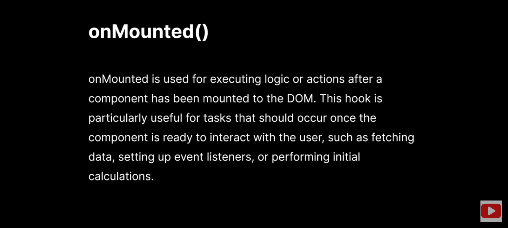

# Hellow World And Nested Components

```js
//parent.vue
<script setup>
//console.log("Hello VueJs");
import AnotherComp from './AnotherComp.vue';
</script>

<template>
    <h1>Hello VueJs!💚 (parent component)</h1>
    <p>Lorem ipsum dolor sit amet, consectetur adipisicing elit. Nesciunt quidem delectus eveniet eum eligendi voluptatum suscipit qui libero cupiditate beatae?</p>
    <AnotherComp/>
</template>

<style>
h1 {
  color:green;
}
</style>

//child.vue
<template>
    <h2>Another component ⚙️</h2>
    <h3><em>This is some extra content from Children Comp.</em></h3>
</template>
```

# Text interpolation

```js
<script setup>
const myMsg = 'Txt iterpolation with {{}}';
const myNum = 100;
function add(x, y) {
	return x + y;
}
</script>

<template>
	<h3>{{ myMsg }}</h3>
	<h3>{{ myNum }}</h3>
	<h3>2+2 = {{ 2 + 2 }}</h3>
	<h1>Add two nums: {{ add(5, 5) }}</h1>
</template>
```

# Attribute Bindings

Attribute binding is a way to bind HTML "attributes" to data in Vue instances.

- Old Way=> v-bind:attr
- New Way=> :attr

```js
<script setup>
const myChannel = 'https://www.youtube.com/@skyy_banerjee';
const stegoSaurusImg =
	'https://cdn.mos.cms.futurecdn.net/owYTb9X5fKpeBhgiaxD73b-1200-80.jpg';
const altTag = '-img of a dinosaur';
const imgWidth = 400;
const imgHeight = 350;
</script>

<template>
    <h2>Attribute/data bindings!</h2>
	<a :href="myChannel">My Channel</a>
	
</template>
```

# Dynamic Bindings

```js
<script setup>
const imageInfo = {
	src: 'https://cdn.mos.cms.futurecdn.net/owYTb9X5fKpeBhgiaxD73b-1200-80.jpg',
	alt: 'Just a random txt',
	width: 400,
	height: 350,
};
</script>

<template>
	<h2>Dynamic binding!</h2>
	
	
    <!-- both are same -->
</template>
```

# Styling in Vue

```html
<!-- App.vue -->
<script setup>
	import GlobalStyle from './components/GlobalStyle.vue';
	import LocalStyle from './components/LocalStyle.vue';
</script>

<template>
	<GlobalStyle />
	<LocalStyle />
</template>

<!-- GlobalStyle.vue -->
<template>
	<h1 class="txt-red">Global Styling</h1>
	<p class="local">Trying local scope in this component</p>
</template>

<!-- Global Style -->
<!-- <style>
// .txt-red {
// 	color: red;
// }
// </style> -->

<!-- scoped = local style -->
<style scoped>
	.txt-red {
		color: red;
	}
</style>

<!-- LocalStyle.vue -->
<template>
	<h2 class="txt-red">This is children component in LocalStyle</h2>
</template>

<style scoped>
	.txt-red {
		color: red;
	}
</style>

<!-- CombinedStyle.vue -->
<template>
	<h2 class="g-1">Another Global Style</h2>
	<h2 class="l-1">Another Local Style</h2>
</template>

<style>
	/* Global Style */
	.g-1 {
		background-color: fuchsia;
		color: white;
	}
</style>

<style scoped>
	/* Local Style */
	.l-1 {
		background-color: black;
		color: white;
	}
</style>

<!-- ModuledStyle.vue -->
<template>
	<!-- <h1 :class="$style['m-class']">Using Moduled CSS with $ syntax (kebab-case)</h1> -->
	<h1 :class="$">Using Moduled CSS with $ syntax (camel-cse)</h1>
</template>

<style module="myClasses">
	/* kebab-case*/
	.m-class {
		background-color: firebrick;
		color: white;
	}

	/* camel case */
	.anotherClass {
		background: seagreen;
		color: white;
	}
</style>
```

# Event Handlers in Vue.

- What is Reactivity?

Reactivity means that the framework can automatically update (UI) when the information behind it changes. It's a core concept that allows us to create "dynamic" & "responsive" applications without manually manipulating the DOM.

- Reactive State: reactive(), ref()

1. reactive()

- Returns a reactive proxy of the object.
  The reactive conversion is "deep": it affects all nested properties. A reactive object also deeply unwraps any properties that are refs while maintaining reactivity.

- The reactive fx is used to create reactive objects. A reactive object is an object where changes to it's properties are automatically detected, triggering updates🟢 in the user interface. It is a way to make a object "reactive" in Vue.js.

- ❌ Can't store primitive data types ❌

```html
<script setup>
	import { reactive } from 'vue';
	let initialState = reactive({ count: 0 });
</script>

<template>
	<h1>Count: {{ initialState.count }}</h1>
	<button @click="initialState.count++">+</button>
	<button @click="initialState.count--">-</button>
	<button @click="initialState.count=0">⚙️</button>
</template>
```

```html
<script setup>
	//A bit more complex
	import { reactive } from 'vue';
	let initialState = reactive({
		val: { count: 0 },
		user: ['Skyy', 'Soumadip'],
	});

	function changeUser() {
		initialState.user[0] = 'Michael';
		initialState.user[1] = 'Philip';
	}
</script>
{ }

<template>
	<h1>Curr. Count: {{ initialState.val.count }}</h1>
	<h2>Users: {{ initialState.user }}</h2>
	<button @click="initialState.val.count +=10">Add 10</button>
	<button @click="changeUser">Change User</button>
	<button @click="initialState.user.push('John Doe')">One More</button>
</template>
```

2. ref()

- Takes an inner value and returns a reactive and mutable ref object, which has a single property .value that points to the inner value.

- It is used to create a reactive reference to a value. Unlike the reactive fx, which is used for creating reactive objects, ref is specially designed for creating reactive "single values" 🟢

- ✅ We can store any type of data we want ✅

```html
<script setup>
	//part-1
	import { ref } from 'vue';
	let count = ref(0);

	function incrementCounter() {
		return count.value++;
	}

	function decrementCounter() {
		return count.value--;
	}

	function resetCounter() {
		return (count.value = 0);
	}
</script>

<template>
	<h1>Count: {{ count }}</h1>

	<!-- Old way - <button v-on:click="incrementCounter">Increment</button> -->

	<!-- <button @:click="count++">Increment</button>
    <button @:click="count++">Deccrement</button> -->

	<button @:click="incrementCounter">Increment</button>
	<button @:click="decrementCounter">Deccrement</button>
	<button @:click="resetCounter">Reset</button>
</template>
```

```html
<script setup>
	//Part-2
	function submitHandler(e) {
		e.preventDefault();
		alert('Submitted!');
	}
</script>

<template>
	<form action="" @:submit="submitHandler">
		<input type="text" name="" id="" placeholder="please enter your name" />
		<input type="email" name="" id="" placeholder="please enter your email" />
		<button type="submit">Submit</button>
	</form>
</template>
```

```html
<script setup>
	//Part-3
	const showMsg = (msg) => {
		alert(msg);
	};
</script>

<template>
	<button @:click="showMsg('This is my msg!')">Show message!</button>
</template>
```

```html
<script setup>
	//Part-4
	import { ref } from 'vue';
	let userName = ref('');
	let userList = ref(['Michael', 'Jordan', 'Skyy', 'Banerjee']);
</script>
<template>
	<h1>Username: {{ userName }}</h1>
	<h1>User List: {{ userList }}</h1>
	<button @click="userName = 'Skyy'">Add User</button>
	<button @click="userList.push('John')">Add New User</button>
</template>
```

```html
<script setup>
	//Part-5
	import { ref } from 'vue';
	let userInfo = ref({
		name: 'Alex',
		age: 28,
		location: ['NYC', 'IDK'],
		isMarried: false,
	});
</script>

<template>
	<h1>Name: {{ userInfo.name }}</h1>
	<h2>Age: {{ userInfo.age }}</h2>
	<h2>Location: {{ userInfo.location }}</h2>
	<h2>IsMarried: {{ userInfo.isMarried }}</h2>

	<button @click="userInfo.name='John Cena'">Change Name</button>
	<button @click="userInfo.age=40">Change Age</button>
	<button @click="userInfo.location=['Earth','Meh']">Change Location</button>
	<button @click="userInfo.isMarried=!userInfo.isMarried">
		Toggle Marital Status!
	</button>
</template>
```

```html
<script setup>
	//Mixture, part-6
	import { reactive, ref } from 'vue';
	let friends = reactive([ref('Jordan'), ref('Alex'), ref('Skyy')]);
</script>

<template>
	<h1>1.{{ friends[0] }}</h1>
	<h1>2. {{ friends[1] }}</h1>
	<h1>3. {{ friends[2] }}</h1>

	<button @click="friends[0]='🤝'">Hand Shake</button>
	<button @click="friends[1]='🤝'">Hand Shake</button>
	<button @click="friends[2]='🤝'">Hand Shake</button>
</template>
```

# Computed Properties

- A computed property is a special kind of variable that "automatically updates"⚙️ itself whenever the data it depends on changes.

- It's like a little worker that watches certain data, performs some work on it, and always gives us the most up-to-date result.

- Takes a getter function and returns a readonly reactive ref object for the returned value from the getter. It can also take an object with get and set functions to create a writable ref object.

```html
<script setup>
	import { ref, computed } from 'vue';
	const number = ref(5);
	const firstName = ref('Skyy');
	const lastName = ref('Banerjee');

	const squaredNum = computed(() => {
		return number.value * number.value;
	});

	const fullName = computed(() => firstName.value + ' ' + lastName.value);
</script>

<template>
	<h2>Original Num: {{ number }}</h2>
	<h2>Squared Num: {{ squaredNum }}</h2>
	<h2>FullName: {{ fullName }}</h2>
</template>
```

```html
<script setup>
	import { ref, computed } from 'vue';
	const counter = ref(0);

	const squaredCounter = computed(() => counter.value ** 2);
	const incrementCounter = () => {
		counter.value++;
	};
</script>

<template>
	<h1>Counter: {{ counter }}</h1>
	<p>Squared Counter: {{ squaredCounter }}</p>
	<button @click="incrementCounter">Increment Counter</button>

	<!-- O/P;
	Counter: 6
Squared Counter: 36
Increment Counter btn -->
</template>
```

# Conditional Rendering

- Conditional rendering refers to the ability to conditionally display or hide elements in the UI based on certain "conditions or expressions". 🟫

- v-if(condition), v-else-if(condition), v-else, v-show

```html
<script setup>
	const isTrue = true;
	const isFalse = false;
</script>

<template>
	<h2 v-if="isTrue">This will show if isTrue is true!</h2>
	<h2 v-else-if="isFalse">This will show if isFalse is true!</h2>
	<h2 v-else>This will show if neither isTrue or isFalse is true</h2>
</template>
```

```html
<script setup>
	import { ref } from 'vue';
	let isVisible = ref(true);
</script>

<template>
	<!-- v-show -->
	<p v-show="isVisible">
		This paragraph will be shown or hidden based on the value of isVisible
	</p>
	<button @click="isVisible=!isVisible">Toggle Visibility</button>
</template>
```

```html
<script setup>
	import { ref } from 'vue';
	let isUserLoggedIn = ref(true);
	let userName = 'Skyy';
	let showDetails = ref(isUserLoggedIn);
</script>

<template>
	<div class="">
		<h1 v-if="isUserLoggedIn">Welcome {{ userName }}</h1>
		<p v-else>Please log in to access this content</p>

		<div class="" v-show="showDetails">
			<h4>You are now able to modify your DashBoard!</h4>
		</div>
	</div>
</template>
```

```html
<script setup>
	import { ref } from 'vue';
	const isActive = ref(true);
</script>

<template>
	<div v-if="isActive">
		<h1>My BlogPost</h1>
		<p>
			Lorem ipsum dolor, sit amet consectetur adipisicing elit. Accusantium
			placeat magnam, facilis veniam reiciendis accusamus aperiam perspiciatis
			obcaecati unde distinctio eius, natus iure dignissimos animi omnis
			excepturi, id quo. Id reprehenderit aspernatur alias temporibus impedit,
			praesentium, accusamus omnis adipisci asperiores doloremque fugiat a sint,
			delectus laudantium. Voluptates unde labore magni error molestias facere
			expedita, eum, reiciendis aut est porro enim sed quis dolorem, dolorum
			vel.
		</p>
	</div>
	<button @click="isActive=!isActive">Toggle Post!</button>
</template>
```

```html
<script setup>
	import { ref } from 'vue';
	const password = ref('mypersonalstrongpassword1234');
</script>

<template>
	<h1 v-if="password.length>8">Strong Password</h1>
	<h1 v-else-if="password.length<8">Weak Password</h1>
	<h1 v-else>Please enter your password!</h1>
</template>
```

# v-for

- The v-for directive is used to "iterate" over an array[] or an object{} and render a template for each item in that collection.
  
  

```html
<script setup>
	import { ref } from 'vue';
	let people = ref(['John', 'Skyy', 'Banerjee']);
</script>

<template>
	<h2 v-for="(person, idx) in people" :key="idx">{{ idx }} : {{ person }}</h2>
</template>
```

```html
<script setup>
	import { ref } from 'vue';
	const books = ref([
		{
			id: 1,
			title: 'The Great Gatsby',
			author: 'F. Scott Fitzgerald',
			genre: 'Fiction',
			publicationYear: 1925,
		},
		{
			id: 2,
			title: 'To Kill a Mockingbird',
			author: 'Harper Lee',
			genre: 'Fiction',
			publicationYear: 1960,
		},
		{
			id: 3,
			title: '1984',
			author: 'George Orwell',
			genre: 'Dystopian Fiction',
			publicationYear: 1949,
		},
		{
			id: 4,
			title: 'Pride and Prejudice',
			author: 'Jane Austen',
			genre: 'Romance',
			publicationYear: 1813,
		},
		{
			id: 5,
			title: 'The Catcher in the Rye',
			author: 'J.D. Salinger',
			genre: 'Coming-of-age Fiction',
			publicationYear: 1951,
		},
		{
			id: 6,
			title: "Harry Potter and the Philosopher's Stone",
			author: 'J.K. Rowling',
			genre: 'Fantasy',
			publicationYear: 1997,
		},
	]);
</script>

<template>
	<ul
		v-for="({ id, title, author, genre, publicationYear }, idx) in books"
		:key="idx"
	>
		<li>Book Id: {{ id }}</li>
		<li>title: {{ title }}</li>
		<li>Author: {{ author }}</li>
		<li>Genre: {{ genre }}</li>
		<li>Publication Year: {{ publicationYear }}</li>
	</ul>
</template>
```

```html
<script setup>
	import { ref } from 'vue';
	const movies = ref([
		['The Shawshank Redemption', 'The Godfather', 'The Dark Knight'],
		['Pulp Fiction', 'Fight Club', 'Forrest Gump'],
		['Inception', 'The Matrix', 'Interstellar'],
		[
			'The Silence of the Lambs',
			'Goodfellas',
			"Schindler's List",
			'The Lord of the Rings',
		],
		[
			'The Departed',
			'Gladiator',
			'The Green Mile',
			'The Prestige',
			'The Usual Suspects',
		],
		[
			'Se7en',
			'Memento',
			'The Lion King',
			'Eternal Sunshine of the Spotless Mind',
			'The Truman Show',
			'The Social Network',
		],
	]);
</script>

<template>
	<h3>Nested Arrays[ ]</h3>
	<ul v-for="(movie, idx) in movies" :key="idx">
		<li v-for="(m, mIdx) in movie" :key="mIdx">{{ m }}</li>
	</ul>
</template>
```

```hmtl
<script setup>
import { ref } from 'vue';
const games = ref({
	id: 1,
	title: 'Epic Adventure Game',
	genre: ['Action', 'Adventure', 'RPG'],
	platform: ['PC', 'PlayStation', 'Xbox', 'Nintendo Switch'],
	releaseDate: '2022-03-15',
	developer: {
		name: 'Awesome Game Studios',
		location: 'San Francisco, CA',
		teamSize: 50,
	},
	ratings: {
		metacritic: 90,
		user: 4.8,
	},
	features: {
		singlePlayer: true,
		multiplayer: true,
		onlineCoop: true,
		splitScreen: false,
	},
	systemRequirements: {
		minimum: {
			os: 'Windows 10',
			processor: 'Intel Core i5',
			memory: '8 GB RAM',
			graphics: 'NVIDIA GTX 970',
			storage: '50 GB available space',
		},
		recommended: {
			os: 'Windows 11',
			processor: 'Intel Core i7',
			memory: '16 GB RAM',
			graphics: 'NVIDIA RTX 3080',
			storage: '100 GB available space',
		},
	},
	storyline:
		'Embark on a thrilling adventure to save the world from impending doom!',
	characters: ['Hero', 'Sidekick', 'Villain', 'NPCs'],
	achievements: [
		{
			id: 1,
			name: 'Master Explorer',
			description: 'Explore every corner of the game world',
		},
		{
			id: 2,
			name: 'Legendary Warrior',
			description: 'Complete the game on the hardest difficulty',
		},
	],
});
</script>

<template>
	<h3>Nested Arrays[ ]</h3>
	<ul v-for="(values, idx, keys) in games" :key="value">
		{{idx }} - {{ values }} - {{ keys }}
	</ul>
</template>
```

```html
<script setup>
	import { ref } from 'vue';
	//nested objs{}
	const compexGameObj = ref([
		{
			title: 'The Witcher 3: Wild Hunt',
			platform: 'PlayStation 4, Xbox One, Microsoft Windows, Nintendo Switch',
			genre: 'Action role-playing',
			releaseDate: 'May 19, 2015',
		},
		{
			title: 'The Legend of Zelda: Breath of the Wild',
			platform: 'Nintendo Switch, Wii U',
			genre: 'Action-adventure',
			releaseDate: 'March 3, 2017',
		},
		{
			title: 'Red Dead Redemption 2',
			platform: 'PlayStation 4, Xbox One, Microsoft Windows, Stadia',
			genre: 'Action-adventure',
			releaseDate: 'October 26, 2018',
		},
		{
			title: 'Super Mario Odyssey',
			platform: 'Nintendo Switch',
			genre: 'Platform',
			releaseDate: 'October 27, 2017',
		},
		{
			title: 'Persona 5',
			platform: 'PlayStation 3, PlayStation 4',
			genre: 'Role-playing',
			releaseDate: 'September 15, 2016',
		},
		{
			title: 'The Last of Us Part II',
			platform: 'PlayStation 4',
			genre: 'Action-adventure',
			releaseDate: 'June 19, 2020',
		},
	]);
</script>

<template>
	<h3>Nested Objs{}</h3>
	<ul v-for="(game,idx) in compexGameObj" :key="idx">
		<!-- Getting all games -->
		<li>{{ game }}</li>
		<br />
		<!-- Geting single value fromcObj{} -->
		<li v-for="(property, gIdx) in game" :key="gIdx">{{ property}}</li>
	</ul>
</template>
```

# v-model

- v-model is a directive that provides two-way data binding on an input, textarea or select element. It creates a "connection" between the data in our component and the input field, allowing changes in one to automatically update the other and vice versa. (2 way data binding)
- syncing what we see on the screen (UI) with what we put in, without writing a lot of code.

```html
<script setup>
	import { ref } from 'vue';

	const formData = ref({ username: '', password: '', email: '' });
</script>

<template>
	<form @submit.prevent>
		<input
			type="text"
			placeholder="Please enter your name.."
			v-model="formData.username"
		/>
		<input
			type="email"
			placeholder="Please enter your email.."
			v-model="formData.email"
		/>
		<input
			type="password"
			placeholder="Please enter your password.."
			v-model="formData.password"
		/>
		<button type="submit">Submit</button>
	</form>
	<h1>UserName: {{ formData.username }}</h1>
	<h1>email: {{ formData.email }}</h1>
	<h1>password: {{ formData.password }}</h1>
</template>
```

# Props in VueJs

1. Static Props

```html
<!-- //App.vue -->
<script setup>
	import MyComponent from './components/MyComponent.vue';
</script>

<template>
	<MyComponent name="Skyy" />
</template>

<!-- //MyComponent.vue -->
<script setup>
	//import {ref} from 'vue';
	const props = defineProps(['name']);
	/*
Vue <script setup> compiler macro for declaring component props. The expected argument is the same as the component props option.
*/
</script>

<template>
	<h1>{{ props.name }}</h1>
</template>
```

2. Dynamic Props

```html
<!-- App.vue -->
<script setup>
	import { ref } from 'vue';

	const firstName = ref('Skyy');
	const lastName = ref('Banerjee');

	import MyComponent from './components/MyComponent.vue';
</script>

<template>
	<MyComponent :firstName="firstName" :lastName="lastName" />
</template>

<!-- MyComp.vue -->
<script setup>
	//import {ref} from 'vue';
	const props = defineProps(['firstName', 'lastName']);
	/*
Vue <script setup> compiler macro for declaring component props. The expected argument is the same as the component props option.
*/
</script>

<template>
	<h1>{{ props.firstName }}</h1>
	<h1>{{ props.lastName }}</h1>
</template>
```

- Warning ⚠️

```html
<script setup>
	const myFavNumProp = defineProps(['myFavNumber']); //45, from App.vue
	//Props are immutable
	//Props are readonly
	// ❌ myFavNumProp.myFavNumber = 10; ❌
</script>

<template>
	<h1>{{ myFavNumProp.myFavNumber }}</h1>
</template>
```

```html
<script setup>
	//Basic Validaton
	// const props = defineProps({
	// 	fullName: String,
	// 	age: Number,
	// });

	//Complex Validaton
	const props = defineProps({
		fullName: {
			type: String,
			required: true,
			default: 'Anonymous',
		},
		age: Number,
	});
</script>

<template>
	<h1>Full Name => {{ props.fullName }}</h1>
	<h1>Age=> {{ props.age }}</h1>
</template>
```

```html
<!-- App.vue -->
<script setup>
	//More complexity
	import MyComponent from './components/MyComponent.vue';
</script>
<template>
	<MyComponent
		:friends="['alex', 'john', 'jordan', 'Skyy']"
		:userInfo="{
			name: 'Soumadip',
			age: 28,
			location: ['Kolkata', 'West Bengal'],
		}"
	/>
</template>

<!-- MyComp.vue -->
<script setup>
	defineProps({
		friends: Array,
		userInfo: Object,
	});
</script>

<template>
	<h2>{{ friends }}</h2>
	<h2>{{ userInfo }}</h2>
	<hr />
	<ul v-for="(friend,idx) in friends" :key="idx">
		<li>{{ friend }}</li>
	</ul>
	<hr />
	<ul v-for="(info,idx) in userInfo" :key="idx">
		<li>{{ info }}</li>
	</ul>
</template>
```

```html
<script setup>
	//Custom Prop Validators in VueJs
	defineProps({
		name: {
			type: String,
			validator: (propValue) => {
				return ['Skyy', 'Jordan', 'Bob'].includes(propValue);
			},
		},
		age: {
			type: Number,
			validator: (propValue) =>
				propValue >= 18 && propValue <= 30 ? true : false,
		},
		password: {
			validator: (propValue) => propValue.length >= 8,
		},
	});
</script>

<template>
	<h2>Age: {{ name }}</h2>
	<h2>Age: {{ age }}</h2>
	<h2>Password: {{ password }}</h2>
</template>
```

# Component Events

- Component events are ways for child components to communicate with their "parent components🧑🏻‍👩🏻‍👦🏻". They allow child components to emit events (custom events) that can be listened to and handled by their parent components.⬆️

1. Child Component Emits an Event⚡
   Inside a child component, we can use the "$emit" method() to trigger a custom event. This event can carry data that we want to send to the parent.

2. Parent Component Listens to the Event👂🏻

- In the parent component's template, we can use the 'v-on' directive (or the shorthand @) to listen for the custom event emitted by the child.

```html
<!-- App.vue/Parent -->
<script setup>
	//Counter example
	import MyComponent from './components/MyComponent.vue';
	import { ref } from 'vue';
	let count = ref(0);
</script>

<template>
	<h1>Count: {{ count }}</h1>
	<MyComponent @incrementCounter="count++" />
</template>

<!-- MyComponent.vue/child -->
<script setup>
	import { ref } from 'vue';
</script>

<template>
	<button @click="$emit('incrementCounter')">+</button>
</template>
```

```html
<!-- App.vue/Parent -->
<script setup>
	import MyComponent from './components/MyComponent.vue';
	//Form example
	function formHandler(userName, email, password) {
		console.log('userName:', userName);
		console.log('email', email);
		console.log('password', password);
	}
</script>

<template>
	<MyComponent @userInfo="formHandler" />
</template>

<!-- MyComponent.vue/child -->
<script setup>
	import { ref } from 'vue';
	const userName = ref('');
	const email = ref('');
	const password = ref('');
</script>

<template>
	<form @submit.prevent="$emit('userInfo', userName, email, password)">
		<input type="text" v-model="userName" placeholder="Enter the username.." />
		<input type="email" v-model="email" placeholder="Enter the email.." />
		<input
			type="password"
			v-model="password"
			placeholder="Enter the password.."
		/>
		<button type="submit">Submit</button>
	</form>
</template>
```

# Slot

- A slot is like a "space in a component"🕳️ where we can put different things. it allows us to create reusable components that can accept different content while maintaining a consistent structure.

- The slot element is a placeholder inside a web component 💻 that you can fill with your own markup, which lets you create separate DOM trees and present them together. (src: MDN)

```html
<!-- Parent -->
<script setup>
	import MyComponent from './components/MyComponent.vue';
</script>

<template>
	<MyComponent>
		<h1>Content 1</h1>
		<h2>Content 2</h2>
	</MyComponent>
</template>

<!-- Child -->
<script setup></script>

<template>
	<!-- Creating a slot -->
	<slot> </slot>
</template>
```

1. Fallback/Default Content 🛡️

- Fallback content in slots refer to the default content that is displayed when no content is provided for a particular slot. It's a way to ensure that a component still has "meaningful content", even if the parent component does not pass any content to the specified slot.

```html
<!-- Parent -->
<script setup>
	import MyComponent from './components/MyComponent.vue';
	//import { ref } from 'vue';
</script>

<template>
	<MyComponent></MyComponent>
	<MyComponent><h1>FallBack won't work, cz I'm here (parent)</h1></MyComponent>
</template>

<!-- Child -->
<script setup></script>

<template>
	<slot>
		<h1>Default/FallBack content (child)</h1>
	</slot>
</template>
```

2. Named Slots ⭕

- A named slot is a way to "assign a specific name" to a slot in a component. Unlike the default slot, which is unnamed and is used when no explicit name is provided. Named slots allow us to have multiple slots in a component and specify where the content should be inserted based on the slot's name.

```html
<!-- parent -->
<script setup>
	import MyComponent from './components/MyComponent.vue';
	//import { ref } from 'vue';
</script>

<template>
	<MyComponent>
		<!-- v-slot:one -->
		<template v-slot:one>
			<h1>This content will go to slot one 🟪</h1>
		</template>

		<!-- #two -->
		<template #two>
			<h1>This content will go to slot two 🟩</h1>
		</template>
	</MyComponent>
</template>

<!-- child -->
<script setup></script>

<template>
	<slot name="one"> </slot>
	<slot name="two"> </slot>
</template>
```

```html
<!-- DEFAULT SLOT -->
🟡
<!-- parent -->
<script setup>
	import MyComponent from './components/MyComponent.vue';
</script>

<template>
	<MyComponent>
		<template #default>
			<h1>This is some random DEFAULT CONTENT</h1>
		</template>
	</MyComponent>
</template>

<!-- child -->
<script setup></script>

<template>
	<slot></slot>
</template>
```

# Provide And Inject

- The provide and inject options are used for providing and injecting properties or data "down in the component" hierarchy. They enable a form of dependancy injection, allowing a parent component to provide data or methods that child components can then inject & use. ⚙️💉


- First, without Provide N Inject (prop drilling)

```html
<!-- Top level/Root component -->
<script setup>
	import MyComponent from './components/MyComponent.vue';
	const studentName = 'Alex';
	const studentAge = 20;
	const studentLocation = ['Dallas', 'USA'];
</script>

<template>
	<MyComponent
		:studentName="studentName"
		:studentAge="studentAge"
		:studentLocation="studentLocation"
	/>
</template>

<!-- Child Component -->
<script setup>
	import GrandChildComp from './GrandChildComp.vue';
	defineProps(['studentName', 'studentAge', 'studentLocation']);
</script>

<template>
	<h1>School Component (parent)</h1>
	<GrandChildComp
		:studentName="studentName"
		:studentAge="studentAge"
		:studentLocation="studentLocation"
	/>
</template>

<!-- GrandChild Component -->
<script setup>
	defineProps(['studentName', 'studentAge', 'studentLocation']);
</script>

<template>
	<h1>Student Component (GrandChild of App, Child of MyComponent)</h1>
	<h1>{{ studentName }}</h1>
	<h2>{{ studentAge }}</h2>
	<h3>{{ studentLocation }}</h3>
</template>
```

- Now, with Provide And Inject

```html
<!-- GrandParent/Root Component -->
<script setup>
	import MyComponent from './components/MyComponent.vue';
	import { provide } from 'vue';

	provide('studentName', 'Alex');
	provide('studentAge', 20);
	provide('studentLocation', ['Dallas', 'USA']);
</script>

<template>
	<MyComponent />
</template>

<!-- Child Component -->
<script setup>
	import GrandChildComp from './GrandChildComp.vue';
</script>

<template>
	<h1>School Component (parent)</h1>
	<GrandChildComp />
</template>

<!-- GrandChild Component -->
<script setup>
	import { inject } from 'vue';

	const studentName = inject('studentName');
	const studentAge = inject('studentAge');
	const studentLocation = inject('studentLocation');
</script>

<template>
	<h1>Student Component (GrandChild of App, Child of MyComponent)</h1>
	<h1>{{ studentName }}</h1>
	<h2>{{ studentAge }}</h2>
	<h3>{{ studentLocation }}</h3>
</template>
```

```html
<!-- Parent -->
<script setup>
	import MyComponent from './components/MyComponent.vue';
	import { provide } from 'vue';
	// Provide Array[]
	provide('friends', [
		'Batman',
		'SuperMan',
		'SpiderMan',
		'WonderWoman',
		'Flash',
	]);

	//Provide Object{}
	provide('horrorNovels', {
		id: 1,
		title: 'Dracula',
		genre: ['Horror', 'Gothic', 'Suspense'],
		platforms: ['Amazon', 'FlipKart', 'Ebay'],
		releaseYear: '04-04-1897',
		author: {
			name: "Abraham 'Bram' Stoker",
			nationality: 'Ireland',
			no_of_releases: 5,
		},
	});

	//Provide Array[] of Objects{}
	provide('moreNovels', [
		{
			id: 2,
			title: 'Frankenstein',
			genre: ['Horror', 'Gothic', 'Science Fiction'],
			platforms: ['Amazon', 'Barnes & Noble', 'Book Depository'],
			releaseYear: '01-01-1818',
		},
		{
			id: 3,
			title: 'The Exorcist',
			genre: ['Horror', 'Supernatural', 'Psychological'],
			platforms: ['Amazon', 'Walmart', 'Target'],
			releaseYear: '01-01-1971',
		},
		{
			id: 4,
			title: 'The Shining',
			genre: ['Horror', 'Psychological Thriller'],
			platforms: ['Amazon', 'Booktopia', 'Waterstones'],
			releaseYear: '01-01-1977',
		},
		{
			id: 5,
			title: 'IT',
			genre: ['Horror', 'Supernatural', 'Psychological'],
			platforms: ['Amazon', 'Barnes & Noble', 'Kobo'],
			releaseYear: '09-15-1986',
		},
		{
			id: 6,
			title: 'The Silence of the Lambs',
			genre: ['Horror', 'Psychological Thriller'],
			platforms: ['Amazon', 'Book Depository', 'Indigo'],
			releaseYear: '07-01-1988',
		},
	]);
</script>

<template>
	<MyComponent />
</template>

<!-- Child -->
<script setup>
	import { inject } from 'vue';
	const friends = inject('friends');
	const horrorNovels = inject('horrorNovels');
	const moreNovels = inject('moreNovels');
</script>

<template>
	<h3>Injecting array[ ] (friends) -</h3>
	<ul v-for="(friend, idx) in friends" :key="idx">
		<ul>
			{{ friend }}
		</ul>
	</ul>
	<hr />
	<h3>Injecting Object{ } (horrorNovels) -</h3>
	<ul v-for="(horroNovel, idx) in horrorNovels" :key="idx">
		<li>{{ horroNovel }}</li>
	</ul>
	<hr />
	<h3>Injecting Array[ ] of Objects{ } (moreNovels) -</h3>
	<ul v-for="(novel, idx) in moreNovels" :key="idx">
		<li>{{ novel }}</li>
	</ul>
	<hr />
	<h3>Obj{ } destructuring -</h3>
	<ul
		v-for="({ id, title, genre, platforms, releaseYear }, idx) in moreNovels"
		:key="idx"
	>
		<li>Novel Id: {{ id }}</li>
		<li>{{ title }}</li>
		<li>{{ genre }}</li>
		<li>{{ platforms }}</li>
		<li>{{ releaseYear }}</li>
	</ul>
	<hr />
</template>
```

# Lifecycle Hooks🪝





```html
<!-- App.vue -->
<script setup>
	import MyComponent from './components/MyComponent.vue';
	import { ref } from 'vue';
	const toggle = ref(true);
</script>

<template>
	<MyComponent v-if="toggle" />
	<button @click="toggle=!toggle">
		{{ toggle ? 'Hide Content 🙈' : 'Show Content 👀' }}
	</button>
</template>

<!-- MyComponent.vue -->
import { onBeforeMount } from 'vue';
<script setup>
	import {
		ref,
		onBeforeMount,
		onMounted,
		onBeforeUpdate,
		onUpdated,
		onBeforeUnmount,
		onUnmounted,
	} from 'vue';

	const msg = ref('Hello LifeCycle Hooks!🪝');
	const isUpdated = ref(false);

	// Lifecycle Hooks: will execute accordingly, irrespective of the order
	onBeforeMount(() => {
		console.log(`1. Component is about to be mounted (onBeforeUnmount)`);
	});

	onMounted(() => {
		console.log(`2. Component has been mounted (onMounted)`);
	});

	onBeforeUpdate(() => {
		console.log(`3. Component is about to be updated (onBeforeUpdate)`);
	});

	//updating fx()
	function updateMsg() {
		msg.value = 'Updated Message⚡';
	}

	onUpdated(() => {
		console.log(`4. Component has been updated (onUpdated) ✅`);
		isUpdated.value = true;
	});

	onBeforeUnmount(() => {
		console.log(`5. Component is about to be unmounted (onBeforeUnmount)`);
	});

	onUnmounted(() => {
		console.log(`6. Component has been unmounted (onUnmounted) ☑️`);
	});
</script>

<template>
	<p>{{ msg }}</p>
	<button @click="updateMsg">
		{{ isUpdated ? 'Message updated' : 'Update Message' }}
	</button>
</template>
```

# Watchers 👀


- Syntax => watch(src, callBack, options);
- Ref()
- Reactive object
- Array [ ]
- Getter fx()

- The cllback() is called whenever some data changes
- watch(src, (newVal, oldVal)=>{})

- Options support the following:

1. immediate
2. deep
3. flush
4. onTrack/onTrigger

```html
import { onBeforeMount } from 'vue';
<!-- WatcherComp.vue -->
<script setup>
	import { ref, watch } from 'vue';

	const msg = ref('Hello, Watcher in Vue.js');
	const inputTxt = ref('');

	//watch for changes in inputTxt and update msg accordingly
	watch(inputTxt, (newVal, oldVal) => {
		// We can perform some logic/calculations here, when inputTxt changes
		console.log(newVal);
		console.log(oldVal);
		msg.value = `You typed ${newVal}`;
	});
</script>

<template>
	<h2>{{ msg }}</h2>
	<input type="text" v-model="inputTxt" placeholder="Type something here..." />
</template>
```

```html
<!-- Getter fx() -->
import { onBeforeMount } from 'vue';
<script setup>
	import { reactive, watch } from 'vue';
	const state = reactive({ userName: 'Skyy' });

	// Here, we can't provide specific property of an obj{}.
	// - We have to provide the entire {}, otherwise, we're gona encounter ERROR(s) in the console.
	// - And here, we have to specify the actual object/state "property".

	watch(
		//getter fx()
		() => state.userName,
		(newVal, oldVal) => {
			console.log('newVal: ', newVal);
			console.log('oldVal: ', oldVal);
		},
	);
</script>

<template>
	<h2>{{ state.userName }}</h2>
	<button @click="state.userName = 'Soumadip'">Change Name</button>
</template>
```

```html
<!-- Multiple Srcs -->
<script setup>
	import { ref, watch } from 'vue';
	const userName = ref('Soumadip');
	const count = ref(0);

	watch([userName, count], (newVal, oldVal) => {
		console.log('New value: ', newVal);
		console.log('Old value: ', oldVal);
	});
</script>

<template>
	<h2>{{ userName }}</h2>
	<h2>{{ count }}</h2>
	<button @click="userName = 'Skyy'">Change Name</button>
	<button @click="count++">Increment Counter</button>
</template>
```

# Template Ref


```html
<script setup>
	import { onMounted, ref } from 'vue';
	const myRef = ref('Skyy');
	//console.log(myRef.value);

	onMounted(() => {
		console.log(myRef.value);
		myRef.value.focus();
		myRef.value.value = 'Something else';
	});
</script>

<template>
	<div>
		<input type="text" placeholder="Enter your name.." ref="myRef" />
	</div>
</template>
```

```html
<script setup>
	function myRefFx(el) {
		console.log(el);
		console.log(el.textContent);
		el.textContent = 'Text Changed 🔥';
		el.style.color = 'crimson';
	}
</script>

<template>
	<h1 :ref="myRefFx">This is the initial value 💧</h1>
</template>
```

```html
<!-- // When using <script setup></script>
// - It's private by default
// - A parent referencing a child won't be able to access anything

// First, we have to expose all the  properties and methods
// then we'd be able to use them in parent component
// - use 'defineExpose' to expose our data for the parent-component to use -->

<!-- PARENT -->
<script setup>
	import MyComponent from './components/MyComponent.vue';
	import { ref, onMounted } from 'vue';

	const myRef = ref(null);

	onMounted(() => {
		console.log(myRef.value);
	});
</script>

<template>
	<MyComponent ref="myRef" />
</template>

<!-- CHILD -->
<script setup>
	import { ref, defineExpose } from 'vue';

	const count = ref(0);

	function increment() {
		return count.value++;
	}

	function decrement() {
		return count.value--;
	}

	defineExpose({ count, increment, decrement });
</script>

<template>
	<h1>Count: {{ count }}</h1>
	<button @click="increment">+</button>
	<button @click="decrement">-</button>
</template>
```

# Async Components


```html
<!-- Toggle Friends/Parent -->
<script setup>
	//Toggle Friends
	//import MyComponent from './components/MyComponent.vue';
	import { ref, defineAsyncComponent } from 'vue';
	const RenderFriends = defineAsyncComponent(() =>
		import('./components/MyComponent.vue'),
	);

	let showFriends = ref(false);
	const toggleFriends = () => (showFriends.value = !showFriends.value);
</script>

<template>
	<div v-if="showFriends">
		<RenderFriends />
	</div>
	<button @click="toggleFriends">Toggle Friend List</button>
</template>

<!-- RenderFriends/Child -->
<script setup>
	import { ref } from 'vue';
	//Render Friends
	const friends = ref([
		'Bruce Wayne',
		'Peter Parker',
		'Clark Kent',
		'Tony Stark',
	]);
</script>

<template>
	<h3 v-for="(friend,idx) in friends" :key="idx">{{ friend }}</h3>
</template>
```

# Composables in Vue.js 🧩

- A composable is a fx() or set of fxs() that encapsulate a piece of logic and can be composed together to build the functionality of a Vue component. Composables are designed to be "reusable & shareable" making it easier to manage complex and logic in a Vue application.

- Syntax=> useComposable() //use-> convention

```html
<!-- MyComponent.vue -->
<script setup>
	// Here is a question:
	// What if we wanna use this logic in another component? How can we go about doing that?
	// - Our first answer will be: Well, just call the component in another place
	// -- To call the component in another place, it's gonna give us all the UI (template) in another component as well

	//Soln.
	// The soln. is to extract all the logic from this component and create a seperate COMPOSABLE
	// - Creating a seperate composable will allow us reuse that logic in overall application
	// - & make our code totally clean and organized

	import { useCounter } from '../shared/useMyComponent';
	const counter = useCounter();
</script>

<template>
	<h3>Count: {{ counter.count }}</h3>
	<button @click="counter.increment">+</button>
	<button @click="counter.decrement">-</button>
	<button @click="counter.reset">reset</button>
</template>

<!-- AnotherComponent.vue -->
<script setup>
	import MyComponent from './MyComponent.vue';
</script>

<template>
	<h1>Hello</h1>
	<MyComponent />
</template>
```

```js
import { ref } from 'vue';
//Counter Composable for "./component/MyComponent.vue"
export function useCounter(initialVal = 0) {
	const count = ref(initialVal);

	//fxs.
	const increment = () => count.value++;
	const decrement = () => count.value--;
	const reset = () => (count.value = 0);

	return { count, increment, decrement, reset };
}
```

# Custom Directives ⚙️

- Vue provides a set of built-in directives such as v-if, v-for, v-model, etc. Whereas, custom-directives allow us to define our "own-behaviour" that can be applied to the elements in the template.

**How to create one?**

- A custom directive is defined as an object containing lifecycle hooks similar to component hooks, eg. mounted(), unmounted() etc.

```html
<script setup>
	const vFormateDiv = {
		mounted: (el, binding) => {
			console.log('====================================');
			console.log(el, binding);
			console.log('====================================');
			el.style.fontSize = '4rem';
			el.style.color = 'green';
		},
	};
</script>

<template>
	<div v-formate-div>Using simple custom directive</div>
</template>
```

```html
<script setup>
	const vFormateDiv = {
		mounted: (el, binding) => {
			//el.style.fontSize = binding.value + 'px';
			el.style.fontSize = `${binding.value}rem`;
			el.style.border = `${binding.value}px solid teal`;
		},
	};
</script>

<template>
	<div v-formate-div="5">Using simple custom directive</div>
</template>
```

```html
<script setup>
	const vFormateDiv = {
		mounted: (el, binding) => {
			console.log(binding.arg);
			switch (binding.arg) {
				case 'green':
					el.style.color = 'green';
					break;
				case 'pink':
					el.style.color = 'pink';
					break;
				case 'coral':
					el.style.color = 'coral';
					break;
				case 'teal':
					el.style.color = 'teal';
					break;
				default:
					el.style.color = 'red';
			}
		},
	};
</script>

<template>
	<h2 v-formate-div:green>Using simple custom directive</h2>
	<h2 v-formate-div:coral>Using simple custom directive</h2>
	<h2 v-formate-div:pink>Using simple custom directive</h2>
	<h2 v-formate-div:teal>Using simple custom directive</h2>
	<h2 v-formate-div>Using simple custom directive</h2>
</template>
```

```html
<!-- ShortCut -->
<script setup>
	const vFormative = (el) => (el.style.fontSize = '5rem');
</script>

<template>
	<h2 v-formative>Soumadip Banerjee</h2>
</template>
```

# Dynamic Components

- Dynamic Components refer to the ability to dynamically switch between different components based on certain **conditions** or **user interaction**. This is achieved using the component element & the **:is** attribute.

```html
<!-- main component -->
<script setup>
	import { ref } from 'vue';
	import Comp1 from './Comp1.vue';
	import Comp2 from './Comp2.vue';
	import Comp3 from './Comp3.vue';

	const currentTab = ref('Comp1');

	const tabs = {
		Comp1,
		Comp2,
		Comp3,
	};
</script>

<template>
	<h2>Main Component</h2>
	<button @click="currentTab = 'Comp1'">What is HTML?</button>
	<button @click="currentTab = 'Comp2'">What is CSS?</button>
	<button @click="currentTab = 'Comp3'">What is JavaScript?</button>

	<!-- Dynamic Component -->
	<component :is="tabs[currentTab]" />
</template>

<!-- Component 1 -->
<script setup></script>

<template>
	<h2>What is HTML?</h2>
	<p>
		HTML, or HyperText Markup Language, is the standard markup language used to
		create web pages and applications. It defines the structure and content of
		web content, such as paragraphs, lists, images, and data tables. HTML is
		free and relatively easy to read, using plain English text with extra
		symbols. HTML elements are designated by tags, with most elements having an
		opening tag and a closing tag.
	</p>
</template>

<!-- Component 2 -->
<script setup></script>

<template>
	<h2>What is CSS?</h2>
	<p>
		CSS stands for Cascading Style Sheets, and it's a stylesheet language that
		describes how HTML or XML documents should be presented. CSS is used in web
		design to control the layout and presentation of web pages. It's essential
		because it allows designers to customize the appearance of websites, making
		them visually appealing and user-friendly.
	</p>
</template>

<!-- Component 3 -->
<script setup></script>

<template>
	<h2>What is JavaScript?</h2>
	<p>
		JavaScript, often abbreviated as JS, is a programming language and core
		technology of the Web, alongside HTML and CSS. 99% of websites use
		JavaScript on the client side for webpage behavior. Web browsers have a
		dedicated JavaScript engine that executes the client code.
	</p>
</template>
```

# Fetching Data in Vue 🛜

```html
<script setup>
	import { ref } from 'vue';
	const data = ref(null);
	const url = `https://jsonplaceholder.typicode.com/todos/1`;
	function fetchData() {
		// Make a get request using 'fetch'
		fetch(url)
			.then((resp) => {
				// Check if the response status is okay or not (200-299 range)
				if (!resp.ok) {
					throw new Error(`HTTP Error! Status: ${resp.status}`);
				}

				// Parse the JSON response
				return resp.json();
			})
			.then((resp) => {
				data.value = resp;
			})
			.catch((err) => {
				console.err(`Error: ${err.message}`);
			});
	}
</script>

<template>
	<div>
		<h1>Using Fetch</h1>
		<button @click="fetchData">Fetch Data</button>
		<h2>Data from API:</h2>
		<pre>{{ data }}</pre>
	</div>

	<!-- O/P:
	{
  "userId": 1,
  "id": 1,
  "title": "delectus aut autem",
  "completed": false
} -->
</template>
```

```html
<!-- Now, using Axios Library-->
<script setup>
	import { ref } from 'vue';
	import axios from 'axios';
	const data = ref(null);
	const url = `https://jsonplaceholder.typicode.com/posts`;

	async function fetchData() {
		try {
			//Make GET req. using AXIOS
			const resp = await axios.get(url);

			//Handle successful response
			data.value = resp.data;
		} catch (err) {
			console.log(`Error fetching data: ${err}`);
		}
	}
</script>

<template>
	<div>
		<h1>Using Axios!</h1>
		<button @click="fetchData">Fetch Data</button>
		<div>
			<h2>Data from API:</h2>
		</div>

		<pre>{{ data }}</pre>
	</div>
</template>
```
# ToDo App example in Vue 📝
```html
<script setup>
import { ref } from 'vue';

const newTask = ref('');
const tasks = ref([]);

const addTask = () => {
	if (newTask.value.length.trim() !== '') {
		tasks.value.push(newTask.value);
		newTask.value = '';
	}
};

function removeTask(idx) {
	return tasks.value.splice(idx, 1);
}
</script>

<template>
	<div class="todo-app">
		<div class="task-input">
			<input
				type="text"
				v-model="newTask"
				@keyup.enter="addTask"
				placeholder="Add new Todo/Task.."
			/>
			<button @click="addTask">Add ToDo</button>
		</div>

		<!-- Rendering all the tasks -->
		<ul class="task-list">
			<li v-for="(task, idx) in task" :key="idx">
				{{ task }}
				<button @click="removeTask" class="remove-button">remove</button>
			</li>
		</ul>
	</div>
</template>

<style scoped>
.todo-app {
	max-width: 400px;
	margin: 50px auto;
	padding: 20px;
	border: 1px solid #ccc;
	border-radius: 8px;
	box-shadow: 0 2px 4px rgba(0, 0, 0, 0.1);
}

.app-title {
	font-size: 24px;
	margin-bottom: 20px;
	text-align: center;
	color: #333;
}

.task-input {
	display: flex;
	gap: 10px;
}

input {
	flex: 1;
	padding: 8px;
	font-size: 14px;
}

button {
	padding: 8px 12px;
	font-size: 14px;
	background-color: #4caf50;
	color: #fff;
	border: none;
	border-radius: 4px;
	cursor: pointer;
}

button:hover {
	background-color: #45a049;
}

.task-list {
	list-style: none;
	padding: 0;
}

.task-item {
	display: flex;
	justify-content: space-between;
	align-items: center;
	padding: 10px;
	margin: 8px 0;
	background-color: #f9f9f9;
	border: 1px solid #ddd;
	border-radius: 4px;
}

.remove-button {
	padding: 6px 10px;
	font-size: 12px;
	background-color: #e74c3c;
	color: #fff;
	border: none;
	border-radius: 3px;
	cursor: pointer;
}

.remove-button:hover {
	background-color: #c0392b;
}
</style>
```
# Random Quote Gnerator in Vue 💭
```html
<script setup>
import { ref, onMounted } from 'vue';

const quotes = ref([
	{
		quote: "Life is what happens when you're busy making other plans.",
		author: 'John Lennon',
	},
	{
		quote: 'The only way to do great work is to love what you do.',
		author: 'Steve Jobs',
	},
	{
		quote:
			"In three words I can sum up everything I've learned about life: it goes on.",
		author: 'Robert Frost',
	},
]);

const currQuote = ref({ quote: '', author: '' });

function getRandQuote() {
	const randIdx = Math.floor(Math.random() * quotes.value.length);
	currQuote.value = quotes.value[randIdx]; // Update value using .value property
}

onMounted(getRandQuote);
</script>

<template>
	<div class="quote-generator">
		<h1 class="app-title">Random Quote Genrator</h1>
		<blockquote class="quote-container">
			<p>{{ currQuote.quote }}</p>
			<cite>{{ currQuote.author }}</cite>
		</blockquote>
		<button @click="getRandQuote" class="quote-button">Get Random Quote</button>
	</div>
</template>

<style scoped>
.quote-generator {
	max-width: 400px;
	margin: 50px auto;
	padding: 20px;
	text-align: center;
	border: 1px solid #ccc;
	border-radius: 8px;
	box-shadow: 0 2px 4px rgba(0, 0, 0, 0.1);
}

.app-title {
	font-size: 24px;
	margin-bottom: 20px;
	color: #333;
}

.quote-container {
	background-color: #f9f9f9;
	padding: 20px;
	border-radius: 8px;
	border: 1px solid #ddd;
	margin-bottom: 20px;
}

p {
	font-size: 18px;
	margin-bottom: 10px;
}

cite {
	font-style: normal;
	color: #777;
}

.quote-button {
	padding: 10px 20px;
	font-size: 16px;
	background-color: #3498db;
	color: #fff;
	border: none;
	border-radius: 4px;
	cursor: pointer;
}

.quote-button:hover {
	background-color: #2980b9;
}
</style>
```
